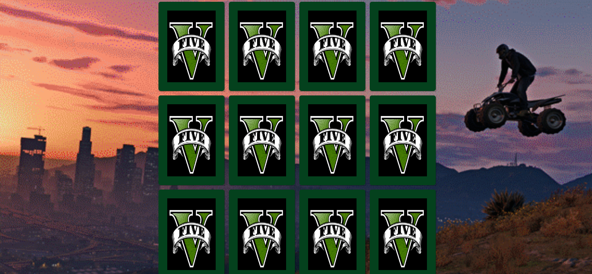

<h1 align="center">Jogo de Memória GTA V</h1>

Projeto de jogo de memória com JavaScript

 
 <a href="#sobre">Sobre</a> •
 <a href="#objetivo">Objetivo</a> •
 <a href="#tecnologias">Tecnologias</a> • 
 <a href="#pre-requisitos">Pré Requisitos</a> • 
 <a href="#demonstracao">Demonstração</a>
 

# Sobre

Este é um projeto de jogo de memória do GTA V desenvovido em JavaScript 

# Objetivo

 Mostrar o desenvolvimento do Jogo de memória do tema GTA V 

# Tecnologias

Foi usado na construção do projeto:

- [JavaScript](https://www.javascript.com/)
- [HTML](https://www.w3schools.com/html/)
- [CSS](https://www.w3schools.com/css/)

# Pre-requisitos

Ter instalado em sua máquina as seguintes ferramentas:

•  Editor de Trabalho: VSCode

# Demonstracao

<h1 align="center">
  
</h1>

